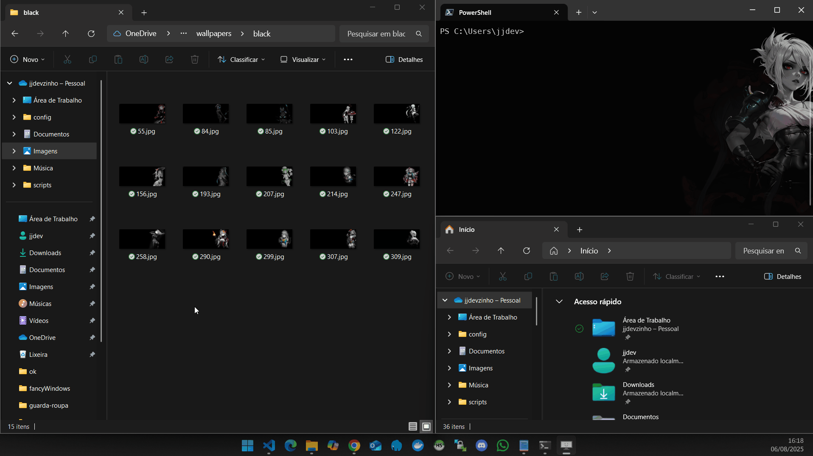
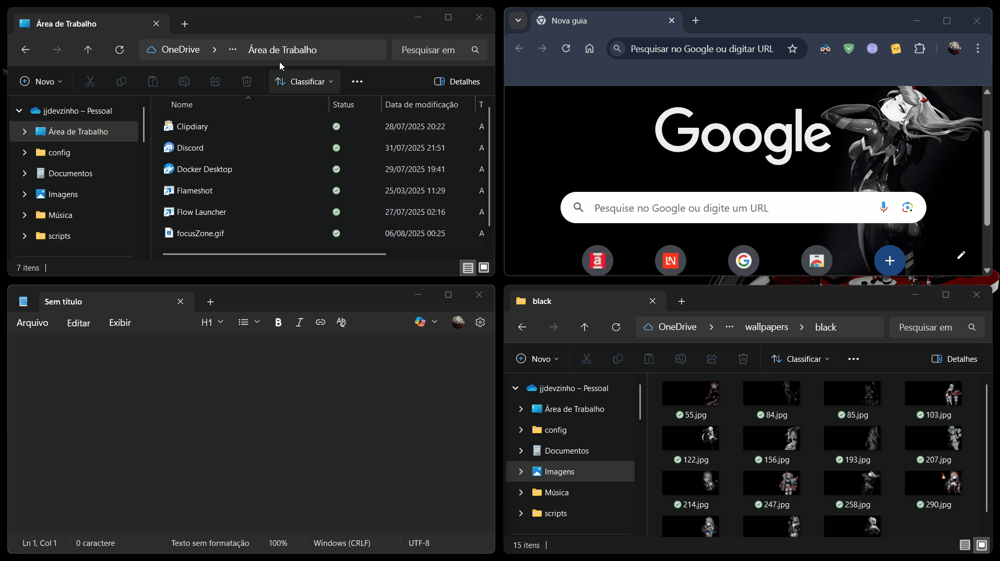
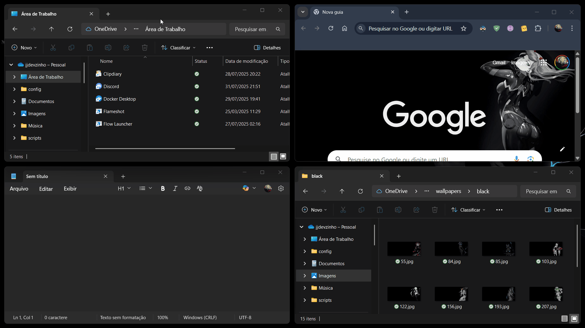
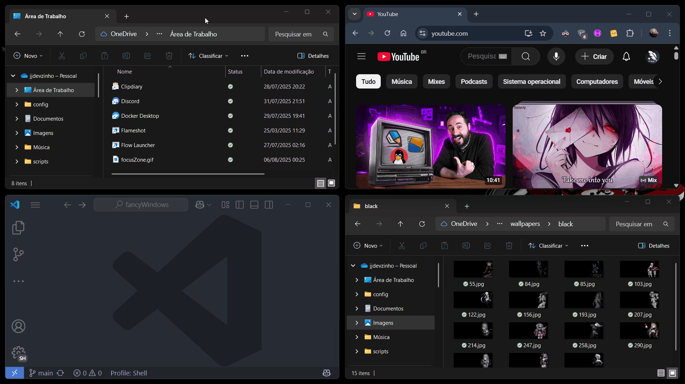
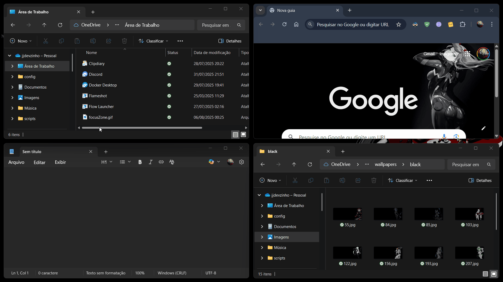

# FancyWindows - Scripts AutoHotkey para Melhoria do Fluxo de Trabalho no Windows

Este é um conjunto de scripts AutoHotkey v2 que adiciona funcionalidades avançadas de gerenciamento de janelas ao Windows, melhorando significativamente o fluxo de trabalho e produtividade.



## 🎯 Para Que Serve

Estes scripts foram especialmente **criados para auxiliar e melhorar o fluxo de trabalho** com o **FancyZones do PowerToys**, oferecendo funcionalidades complementares de navegação e controle de janelas que não existem nativamente.

**Principais benefícios:**
- 🚀 **Navegação rápida** entre janelas sem usar o mouse
- 🎯 **Alternância inteligente** entre janelas do mesmo programa
- 📐 **Controle de posicionamento** e centralização de janelas
- 🎨 **Feedback visual** para melhor orientação espacial
- ⚡ **Atalhos personalizáveis** para fluxo de trabalho otimizado

## 🔧 Compatibilidade

O sistema funciona **perfeitamente** com:
- ✅ **FancyZones (PowerToys)** - Integração completa e funcionalidades complementares
- ✅ **Sistema de snap nativo do Windows** - Melhora a experiência padrão
- ✅ **Janelas tradicionais** - Funciona independentemente de qualquer gerenciador de layout

## 🚀 Como Usar

### 📦 Opção 1: Executável Pronto (Mais Simples)
Baixe o arquivo `FancyWindows.exe` diretamente das [**releases**](../../releases) - não precisa instalar AutoHotkey! 
- ✅ **Vantagem**: Funciona imediatamente, sem dependências
- ❌ **Limitação**: Atalhos são fixos e não podem ser personalizados

### 🛠️ Opção 2: Scripts AutoHotkey (Personalizável)
**Requisitos**: AutoHotkey v2.0.2 ou superior instalado

#### **Modo Básico** (Recomendado)
Execute [`start.ahk`](start.ahk) para iniciar todos os scripts de forma simples e direta.
- ✅ Scripts executam em segundo plano sem menu
- ✅ Para parar, feche pelo ícone do AutoHotkey na bandeja do sistema
- ✅ Mais liberdade para gerenciar os módulos

#### **Modo com Menu Interativo**
Execute [`startWithMenu.ahk`](startWithMenu.ahk) para ter controle visual dos módulos.
- ✅ Menu na bandeja permite ativar/desativar módulos individualmente
- ❌ Atalhos permanecem registrados no AutoHotkey mesmo quando desativados no menu

#### **🔑 Privilégios Elevados** (Opcional)
Para gerenciar janelas de aplicativos executados como administrador, clique com o botão direito em qualquer script e selecione "Executar como administrador".

## 📋 Funcionalidades e Atalhos

### 🎯 Navegação Entre Janelas (com Previews)

#### 1. **Alternar Entre Janelas na Mesma Região**


- **Arquivo**: [`toggleWindowSameZone.ahk`](toggleWindowSameZone.ahk)
- **Atalho**: `Alt + [tecla acima do Tab]`
- **Função**: Alterna entre janelas que estão na mesma posição/tamanho da tela
- **Como usar**: Ideal para janelas maximizadas ou em posições similares
- **💡 Dica**: Usa a mesma tecla física acima do Tab, independente do seu layout de teclado

#### 2. **Navegação Direcional Entre Janelas**


- **Arquivo**: [`focusZone.ahk`](focusZone.ahk)
- **Atalhos**: 
  - `Win + Shift + →` - Focar janela à direita
  - `Win + Shift + ←` - Focar janela à esquerda  
  - `Win + Shift + ↑` - Focar janela acima
  - `Win + Shift + ↓` - Focar janela abaixo

#### 3. **Centralizar Janela**


- **Arquivo**: [`centeredWindow.ahk`](centeredWindow.ahk)
- **Atalho**: `Win + Enter`
- **Função**: Centraliza a janela ativa ocupando 60% da tela. Pressione novamente para restaurar posição original

#### 4. **Alternar Entre Janelas da Mesma Aplicação**


- **Arquivo**: [`toggleWindowSameApp.ahk`](toggleWindowSameApp.ahk)
- **Atalho**: `Win + [tecla acima do Tab]`
- **Função**: Alterna entre todas as janelas abertas do mesmo programa
- **Como usar**: Pressione e segure Win, depois pressione a tecla acima do Tab múltiplas vezes para navegar. Solte Win para confirmar a seleção
- **💡 Dica**: A tecla acima do Tab varia por layout - pode ser ` (crase), ' (aspas), ou outros símbolos, mas a posição física é sempre a mesma

### 🪟 Controle de Janelas

#### 5. **Maximizar/Restaurar Janela**
- **Arquivo**: [`maxRestoreWindow.ahk`](maxRestoreWindow.ahk)
- **Atalho**: `Win + Shift + Enter`
- **Função**: Alterna entre maximizar e restaurar a janela ativa

#### 6. **Maximizar/Minimizar Inteligente**
- **Arquivo**: [`maxMinWindow.ahk`](maxMinWindow.ahk)
- **Atalhos**:
  - `Win + Shift + Page Up` - Maximiza janela (ou restaura última minimizada se pressionado rapidamente)
  - `Win + Shift + Page Down` - Minimiza janela maximizada ou apenas minimiza se não maximizada
- **Função**: Sistema inteligente que lembra da última janela minimizada por 1.75 segundos

#### 7. **Fechar Janela com Confirmação**
- **Arquivo**: [`closeWindow.ahk`](closeWindow.ahk)
- **Atalho**: `Win + Q`
- **Função**: Fecha a janela ativa com diálogo de confirmação

### 🎨 Efeitos Visuais

#### 8. **Borda de Foco Temporária**
- **Arquivo**: [`globalFocusBorder.ahk`](globalFocusBorder.ahk)
- **Função**: Adiciona uma borda colorida temporária (250ms) ao redor da janela quando ela recebe foco
- **Cor**: Usa automaticamente a cor de destaque do tema do Windows

#### 9. **Efeito de Destaque por Flash**
- **Arquivo**: [`globalFocusHighlight.ahk`](globalFocusHighlight.ahk)
- **Função**: Aplica um efeito de flash escuro temporário quando uma janela recebe foco

## ⚙️ Configuração e Personalização

### 📁 Arquivos Principais

- **[`FancyWindows.exe`](../../releases)**: Executável independente com atalhos fixos
- **[`start.ahk`](start.ahk)**: Inicia todos os scripts de forma simples
- **[`startWithMenu.ahk`](startWithMenu.ahk)**: Versão com menu interativo na bandeja

### 🎛️ Configurações Personalizáveis (apenas nos scripts .ahk)

#### Margem de Erro para Detecção de Zona
```ahk
MARGIN_ERROR := 30  ; pixels - ajuste conforme necessário
```

#### Espessura da Borda Visual
```ahk
borderThickness := 2  ; pixels
```

### ✏️ Personalização de Atalhos

Todos os atalhos podem ser modificados editando os respectivos arquivos `.ahk`. As funcionalidades são modulares, permitindo habilitar/desabilitar scripts específicos conforme necessário.

#### Exemplo de Modificação de Atalho

Para alterar `Win + Q` para `Ctrl + Q` no [`closeWindow.ahk`](closeWindow.ahk):
```ahk
; Altere esta linha:
#q:: {
; Para:
^q:: {
```

## 🔧 Requisitos

- **Para executável**: Nenhum requisito adicional
- **Para scripts**: AutoHotkey v2.0.2 ou superior
- **Sistema**: Windows 10/11 (testado)
- **Privilégios elevados**: Opcionais, apenas para gerenciar janelas administrativas

## 🔄 Inicialização Automática com o Windows

Para que o FancyWindows inicie automaticamente junto com o Windows:

### 📦 Para o Executável (`FancyWindows.exe`)
1. **Crie um atalho**: Clique com o botão direito no `FancyWindows.exe` → "Criar atalho"
2. **Copie o atalho**: Recorte ou copie o atalho criado
3. **Abra a pasta de inicialização**: Pressione `Win + R`, digite `shell:startup` e pressione Enter
4. **Cole o atalho**: Cole o atalho na pasta que abriu

### 🛠️ Para os Scripts AutoHotkey
1. **Crie um atalho**: Clique com o botão direito no `start.ahk` (ou `startWithMenu.ahk`) → "Criar atalho"
2. **Copie o atalho**: Recorte ou copie o atalho criado
3. **Abra a pasta de inicialização**: Pressione `Win + R`, digite `shell:startup` e pressione Enter
4. **Cole o atalho**: Cole o atalho na pasta que abriu

**💡 Dica**: Se precisar de privilégios elevados, clique com o botão direito no atalho → "Propriedades" → "Avançado" → marque "Executar como administrador".

## 📁 Estrutura do Projeto

```
fancyWindows/
├── FancyWindows.exe             # Executável independente
├── start.ahk                    # Inicializador simples
├── startWithMenu.ahk            # Inicializador com menu
├── toggleWindowSameApp.ahk      # Alternar janelas mesmo app
├── toggleWindowSameZone.ahk     # Alternar janelas mesma zona
├── focusZone.ahk                # Navegação direcional
├── centeredWindow.ahk           # Centralizar janela
├── maxRestoreWindow.ahk         # Maximizar/restaurar
├── maxMinWindow.ahk             # Maximizar/minimizar
├── closeWindow.ahk              # Fechar com confirmação
├── globalFocusBorder.ahk        # Borda temporária
├── globalFocusHighlight.ahk     # Efeito flash
└── gif/                         # Imagens de preview
    ├── toggleWindowSameApp.gif
    ├── toggleWindowSameZone.gif
    ├── focusZone.gif
    └── centeredWindow.gif
```

## 🤝 Contribuição

Sinta-se livre para modificar, melhorar ou adaptar estes scripts às suas necessidades específicas. Cada módulo foi projetado para ser independente e facilmente personalizável.

## 🙏 Créditos

Parte deste projeto foi desenvolvida e aprimorada com o auxílio do **GitHub Copilot**, que contribuiu significativamente para a criação, otimização e documentação dos scripts.
